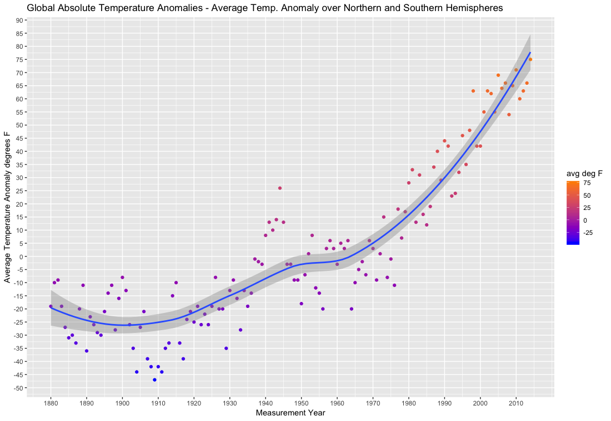
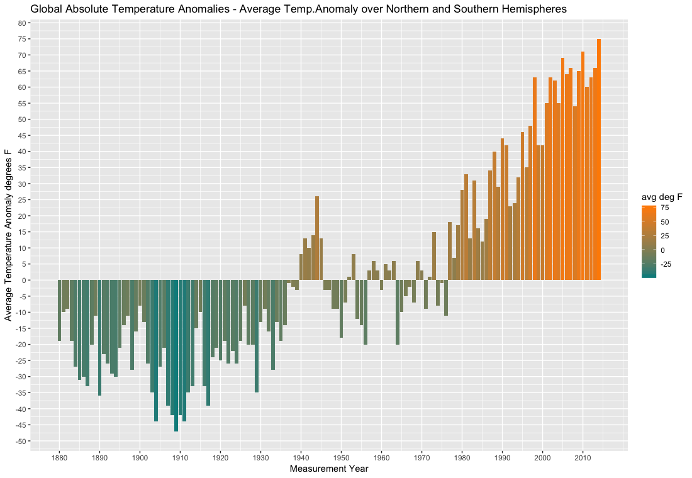
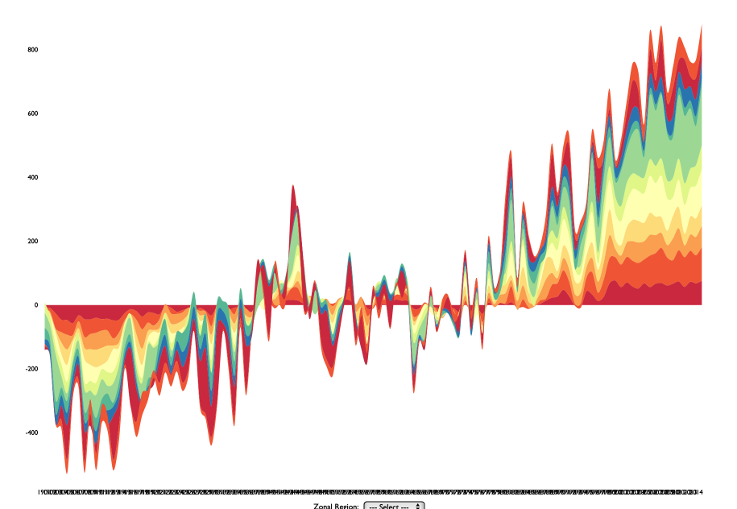

## Climate-Change
#### R package to explore climate change related to global temperature changes over time.
##### Data Visualization| University of Illinois at Urbana Champaign | Fall 2017
##### Created by Tony Gojanovic

***

### Background

The GISS Surface Temperature Analysis (GISTEMP) is an estimate of global surface temperature change. From the NASA GISTEMP website, the history of the data are "Global temperature records start around 1880 because observations did not sufficiently cover enough of the planet prior to that time. The period of 1951-1980 was chosen largely because the U.S. National Weather Service uses a three-decade period to define "normal" or average temperature. The GISS temperature analysis effort began around 1980, so the most recent 30 years was 1951-1980. It is also a period when many of today's adults grew up, so it is a common reference that many people can remember." (Reference https://earthobservatory.nasa.gov/Features/WorldOfChange/decadaltemp.php).

***

### Package Details

This package provides routines for the visualization of global surface temperature change.  Three type of graphs are presented: a **simple line chart**; a **bar plot**; a **streamgraph**.  All graphical displays are based off of the same GISTEMP data set.

This package provides routines to perform the analysis using the differing graph types.  Examples are shown below.

***

### Line Plot with LOESS Smoother

The following *scatter plot* is a *time series* plot of average (north and southern hemispheres) absolute temperature anomalies  Notice we are treating the years as continuous variables.  Also added is a *loess* smoother along with a color gradient to show increase in temperature.  Here we use blue as a "cool"" color and dark orange as a "hot" color.

***

### Bar Plot

The following is a bar chart interpretation of the global temperature anomaly data.  It offers a different perspective than the scatter plot and accentuates the changes more dramatically.  The color gradient was based on desaturating hues a bit and keeping luminance or value at a lower value to not make the colors appear too comical.

***

### Streamgraph

Next, the graph is generated using the *streamgraph* function in which the offset is set at "0" or an ordinary bar chart (which will then have the same variance problems as a bar chart).  Also *sg_legend* is set to "TRUE" which then makes the graph interactive that enables the following of each "flow" through a filter making for a very compelling visual.  Notice that the graph is additive; just like a bar chart, each segment adds up based on the underlying values, hence the y-axis scale must be viewed with caution.  Here the y-axis scale is the cumulative deviations of the zonal regions data temperature data anomalies.  Generally speaking, temperature anomalies are increasing in magnitude e.g.larger temperature swings are beign seen at the "hotter" end of the spectrum.

**Note:** The illustration above is not interactive. The package provides R code that renders the streamgraph interactive.  

***

### Package Name and Location

***

### Travis Badge

The following indicates the status of the most recent build with Travis:

***

### References

